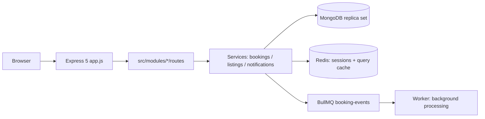

# WanderLust — Travel Listing Platform

A full-stack travel-stay marketplace where hosts list properties with per-room pricing and guests get **instant, race-safe confirmed bookings** — no host approval step.

## Features

* **Instant booking engine** — bookings are confirmed the moment they fit the calendar; overlapping requests cannot double-book (MongoDB transaction + optimistic concurrency).
* **Per-room availability** — a listing can have multiple room types with distinct prices, guest capacities, and independent availability.
* **Blocked-date management** — hosts can block/unblock arbitrary dates with timezone-safe date handling.
* **Notifications** — guests and hosts receive notifications for bookings and cancellations, with an unread badge in the navbar.
* **Ratings & reviews** — one review per booking, own-listing reviews blocked, and average ratings displayed on listing cards.
* **Security** — Helmet + CSP, mongo-sanitize, per-route and authentication rate limiting, server-side Joi validation, and password hashing via `passport-local-mongoose`.
* **Production-style topology** — Redis-backed sessions, cached queries, and a BullMQ `booking-events` queue/worker for background processing.

## Architecture



```text
src/
  common/
    middlewares/   # auth.isLoggedIn, isHost, isAuthor
    services/      # cache.service (Redis)
    utils/         # AppError, async wrapper

  modules/
    auth/          # passport-local signup/login/logout + authentication
    bookings/      # model, service, controller, routes, queue
    listings/      # model, service, controller, routes, validation
    notifications/ # model, service, controller, routes
    reviews/       # model, service, controller, routes, validation
    users/         # user model
```

## Tech Stack

Node.js · Express 5 · Mongoose 8 · EJS + ejs-mate · Redis (node-redis + ioredis) · BullMQ · Passport.js · Cloudinary (Multer) · Joi

## Quick Start

Prerequisites:

* Node.js 18+
* MongoDB configured as a **replica set** (required for transactions)
* Redis

For the local WanderLust setup, MongoDB runs on `127.0.0.1:27017` and Redis runs on `127.0.0.1:6380`.

```bash
git clone https://github.com/raghavr06/wanderlust-travel-platform.git

cd wanderlust-travel-platform

npm install

copy .env.example .env
# Fill in the required environment variables

# Start MongoDB (replica set) and Redis, then:
node app.js
# -> http://localhost:8080

npm test
# Runs the booking test suite
```

### Optional Demo Data

```bash
node init/index.js
```

Demo accounts:

* `demo-host`
* `demo-guest`
* Password: `booklub123`

These credentials are intended for local/demo use only.

## Environment Variables

| Variable                                            | Description                                      |
| --------------------------------------------------- | ------------------------------------------------ |
| `MONGO_URL`                                         | MongoDB connection string                        |
| `REDIS_URL`                                         | Redis URL for sessions, cache, and BullMQ        |
| `SESSION_SECRET`                                    | Long random string used for signed sessions      |
| `CLOUD_NAME` / `CLOUD_API_KEY` / `CLOUD_API_SECRET` | Cloudinary credentials for listing image uploads |

Example local values:

```env
MONGO_URL=mongodb://127.0.0.1:27017/wanderlust
REDIS_URL=redis://127.0.0.1:6380
```

## How Instant Booking Stays Race-Free

Two guests booking the same room for overlapping dates concurrently is the core correctness problem.

WanderLust uses three layers of protection:

1. **Calendar pre-check** — checks strict date overlap:

   `checkIn < existing.checkOut && checkOut > existing.checkIn`

   The check considers both existing bookings and host-blocked dates.

2. **MongoDB transaction + optimistic concurrency** — the booking operation runs inside a MongoDB transaction and updates the listing's `lockVersion`. Competing transactions that modify the same listing document must contend, preventing both requests from successfully committing conflicting bookings.

3. **Bounded retry** — when a transaction encounters a concurrency conflict, the booking operation retries up to three times. If the dates are no longer available, the request returns a conflict and the UI displays:

   `"not available for the selected dates"`

The booking collection remains the source of truth for confirmed stays.

## Testing

* `tests/booking.test.js` — HTTP-level booking tests with mocked service, Redis, and BullMQ infrastructure, including the conflict-handling path.
* `TESTING-GUIDE.md` — full manual verification covering booking rules, concurrent booking attempts, timezone-safe blocking, sorting, guest capacity, caching, queue processing, and same-day turnover.
